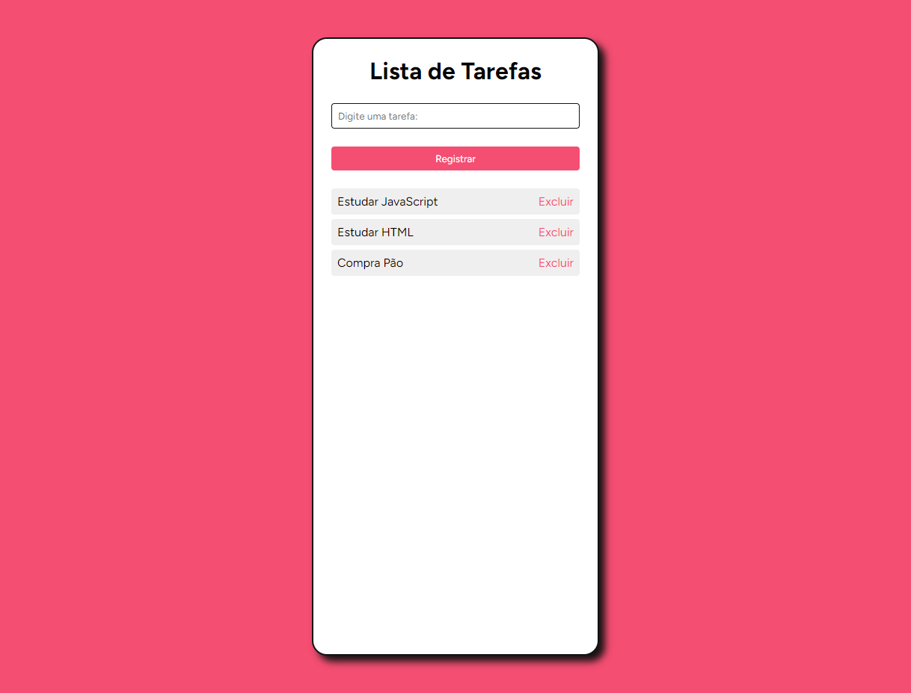
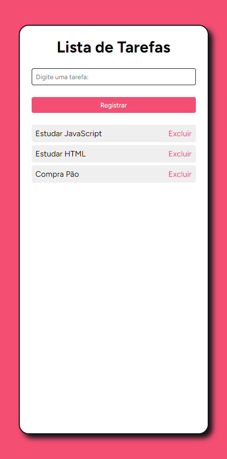

# Projeto Lista de Tarefas
  Projeto do Curso FULLSTACK PRO do Sujeito Programador que estou fazendo e foi usado apenas HTML, CSS e JavaScript. Neste projeto vamos aplicar todos os conhecimentos adquiridos até o momento do curso, vamos criar uma lista de tarefas onde vai conter um input que vai receber a tarefa que o usuário que registrar, e logo abaixo mostrar suas lista de tarefas funcionando como um lembrete para não esquecer.

 ## 🔥 Introdução
Opa pessoal, tudo bem?
Compartilho com vocês meu terceiro projeto de front-end utilizando html e css e agora JavaScript. Esse projeto faz parte do curso do sujeito programador ministrado pelo professor Matheus Fraga.

Nesse terceiro projeto prático do curso consegui utilizar todos os ensinamentos aprendidos nos módulos de html e javascript. Porém, eu implementei a estilização da pagina, todo CSS foi desenvolvido por min, foi otimo para pratica CSS. É um projeto bem simples mais foi minha porta de entrada com Javascript

 ## 👨‍💻 O que eu aprendi
*  Aprendi a acessar nossos elementos do html com o **document.querySelector()**.
* Chamar função ao clicar o botão com o **.onclick**.
* Trabalhar com o **.map()** para percorrer um array
* Criar elementos do html com o **document.createElement("tag html")**.
* A adicionar texto nesses elementos criado com o **document.createTextNode()**.
* E usar corretamente o **.appendChild** para entender seu conceito.
* Usar o **.splice()** para remover item de uma array
* Salvar dados no localStorage com o **localStorage.setItem()**.

### Screenshot

#### Version Desktop

#### Version Mobile

### 📦 Tecnologias usadas

## 👷 Autores

* **Guilherme Alves Silva** - *Aluno do curso* - [GuilhermeAlves](https://github.com/bitsbygui)
* **Sujeito Programador** - *Desenvolvedor do projeto* - [@sujeitoprogramador](https://github.com/devfraga)
  
## 📄 Licença

Esse projeto está sob a licença (MIT) - acesse os detalhes [LICENSE.md](https://github.com/git/git-scm.com/blob/main/MIT-LICENSE.txt).

## 💡 Expressões de gratidão

* Um agradecimento publicamente.
* Para suporte, mande um email para guilhermealvesskr@gmail.com.
* Link para o seu linkedin [Meu linkedin]([https://url_do_link](https://www.linkedin.com/in/guilhermealvessilva/)https://www.linkedin.com/in/guilhermealvessilva/)
